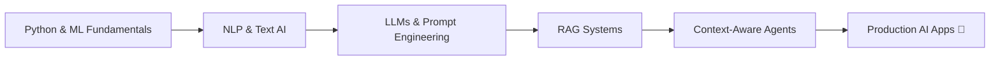

<div align="center">

<!-- Animated Header -->


<!-- Typing Animation -->
<a href="https://git.io/typing-svg">
  
</a>

<br/>

[](https://linkedin.com/in/yourprofile)
[](mailto:youremail@gmail.com)
[](https://github.com/yourusername)

</div>

---

## 🧑‍💻 About Me

I'm a **BE Artificial Intelligence & Machine Learning** student at **Savitribai Phule Pune University (SPPU)**, passionate about building real-world AI solutions — from intelligent assistants to context-aware systems that actually *think*.

- 🎓 Pursuing **BE in AIML** — bridging theory with hands-on projects
- 🐍 Proficient in **Python** for data science, automation, and AI development
- 🤖 Deeply interested in **Generative AI**, **RAG pipelines**, and **NLP**
- 🔁 Enthusiast for **automation workflows** that save time and reduce friction
- 🌱 Currently learning **model training, fine-tuning**, and **context-aware architectures**
- 🧩 I believe: *great AI is built on great engineering fundamentals*

---

## 🚀 Projects

### 🧠 AI Virtual Assistant
> *Your intelligent personal assistant powered by NLP*

A voice/text-based virtual assistant capable of understanding natural language commands, answering queries, and performing automated tasks. Built with Python and integrated NLP pipelines.

**Tech Stack:** `Python` `NLP` `Speech Recognition` `Automation`

[](https://github.com/yourusername/AI_virtual_assistant)

---

### 📅 AI Habit Tracker
> *Track habits intelligently — get insights, not just streaks*

An AI-powered habit tracking application that not only logs habits but analyzes patterns, predicts consistency, and provides personalized recommendations using ML models.

**Tech Stack:** `Python` `Machine Learning` `Data Analysis` `Database Management`

[](https://github.com/yourusername/AI_Habit_Tracker)

---

### 📰 Fake News Detection
> *Fighting misinformation with machine learning*

An NLP-based classification system that detects fake news articles using text preprocessing, feature extraction (TF-IDF / embeddings), and trained ML/DL classifiers. Aimed at promoting media literacy.

**Tech Stack:** `Python` `NLP` `Scikit-learn` `TF-IDF` `Classification Models`

[](https://github.com/yourusername/Fake_News_Detection)

---

## 🛠️ Tech Stack & Skills

### 🧪 AI / ML / Data


### 🗄️ Database Management


### ⚙️ Tools & Platforms


---

## 🌐 Areas of Interest

```
🤖 Generative AI          — LLMs, prompt engineering, AI-powered applications
🔍 RAG (Retrieval-Augmented Generation) — Building context-aware, grounded AI systems  
🧠 NLP                    — Text classification, summarization, semantic search
📐 Context-Aware Architecture — Memory, agents, multi-turn reasoning systems
🔁 Automation             — Workflow automation with Python and AI tools
🎯 Model Training         — Fine-tuning, transfer learning, custom datasets
📊 Data Science           — EDA, feature engineering, predictive modeling
```

---

## 📋 Soft Skills

| Skill | Description |
|-------|-------------|
| 🗂️ **Project Management** | Planning sprints, managing timelines, coordinating deliverables end-to-end |
| 🗃️ **Database Design** | Schema design, query optimization, relational & NoSQL databases |
| 🧩 **Problem Solving** | Breaking complex AI/ML challenges into structured, solvable steps |
| 🤝 **Collaboration** | Team-driven development with clear communication and version control |
| 📖 **Self-Learning** | Consistent learner — research papers, courses, and building side projects |

---

## 📊 GitHub Stats

<div align="center">


<br/>


</div>

---

## 🏆 GitHub Trophies

<div align="center">
  
</div>

---

## 📈 Contribution Activity

<div align="center">
  
</div>

---

## 💡 Current Learning Path



---

## 📫 Let's Connect

<div align="center">

I'm always open to collaborating on interesting AI/ML projects, discussing ideas, or just geeking out about the latest in Gen AI.

**Drop a ⭐ on repos you find useful — it means a lot!**


</div>